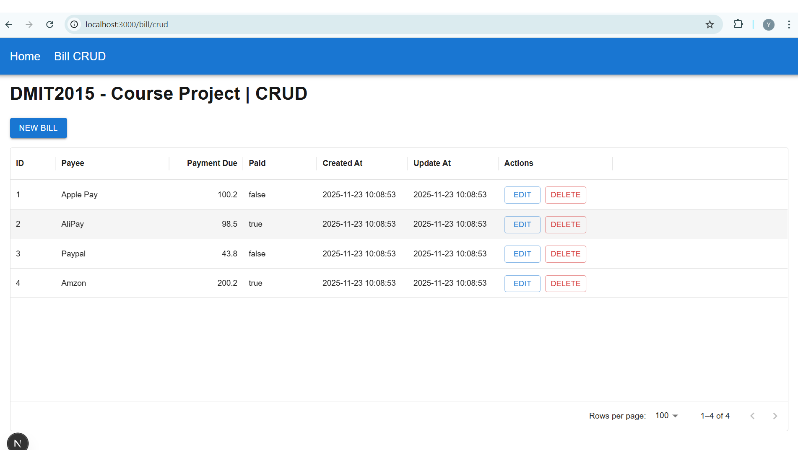

# DMIT2015 Course Project Part 1 - Frontend Instruction

This instruction descripts how to build, test, and run frontend application for this project.

## Development Environment

- OS: Windows 11

- Development Tool: Visual Studio Code

## Configure backend server REST API base URL

- Use Visual Studio Code open project folder

- Go to file react-restclient\restclient\base.js

- Change following url as yours

```
    const BASE_URL = "http://localhost:5281/restapi/BillDtos"
```

## How to Run

- In Visual Studio Code, open a terminal and change to frontend project source code folder

```
    $ cd react-restclient
```

- Install decpendencies

```
    $ npm install
```

- Run 

```
    $ npm run dev
```

- In the terminal, you will see bellow information

```
   ▲ Next.js 16.0.3 (Turbopack)
   - Local:         http://localhost:3000
   - Network:       http://10.0.0.215:3000

 ✓ Starting...
 ✓ Ready in 617ms
```

## How to Test

- Open browser, and input http://localhost:3000 in address and enter

- The home page will open, like bellow


- Navigate to bill CRUD page by clicking menu 'Bill CRUD'



- On this page, we can do CRUD operations for Bill management.

## How Does It Work

- How to call a REST API when the page/view initializes?
  
  - API fetch is used to query data from backend, the code is in file restclient/bill.js

  - When CRUD page is loading, function getBills() in file restclient/bill.js will be call

  ```
    export const getBills = async () => {
        try {
            const resp = await fetch(`${BASE_URL}`);
            if (resp.ok) {
                return await resp.json();
            }

            // failed! Get error from JSON or fallback text
            let err;
            try {
                const json = await resp.json();
                err = json.message || JSON.stringify(json);
            } catch {
                err = await resp.text();
            }
            throw new Error(err);
        } catch (e) {
            console.error("Get bills failed:", e.message);
            throw e;
        }
    }
  ```

- What code fetches and displays all items?

  - When CRUD page is loading, function loadData() will be call to get all bills from backend

  ```
    // load all bills
    const loadData = () => {
        try {
            getBills().then((res) => {
                setBills(res)
            });
        } catch (e) {
            setMessageStatus({ message: e.message, isError: true });
        }
    };

    useEffect(() => {
        loadData();
    }, []);
  ```

  - This function will return a list of Bill, and update it to BillTable component

  - In this component, a DataGrid is used to list all Bill records

  ```
    <DataGrid rows={bills} columns={columns} getRowId={(row) => row.billID} pageSize={10}
    sx={{
        "& .MuiDataGrid-columnHeaderTitle": {
        fontWeight: "bold",
        }
    }} />
  ```

- How is the new-item form rendered and submitted?

  - When we create a new item using 'New Bill' button, an dialog will show to input data

  - useState() is used to update values in UI to object

  - When button 'Save' is clicked, this dialog calls callback function onSave() to pass the new bill object to CRUD page (bill/crud.js)

  - Then, in CRUD page, function createBill() will be called to POST data to backend

  ```
    // save bill for add/edit
    const handleSaveBill = async (bill) => {
        try {
            if (bill.billID > 0) {
                // update
                await updateBill(bill.billID, bill);
                setBills(bills.map((b) => (b.billID === bill.billID ? bill : b)));
                setMessageStatus({ message: `Bill (ID: ${bill.billID}) has updated successfully`, isError: false });
            } else {
                // add a new one
                var newBill = await createBill(bill);
                setBills([...bills, newBill]);
                setMessageStatus({ message: `Bill (ID: ${newBill.billID}) has created successfully`, isError: false });
            }
        } catch (e) {
            setMessageStatus({ message: e.message, isError: true });
        }
    };
  ```

- How to find and update an existing item?

  - In CRUD page, if button 'Edit' is clicked in a row, find the selected bill from this row

  - Then use this bill to initialize Edit Dialog and show it.

  - After data changed and button 'Save' clicked, this dialog calls callback function onSave() to pass the updated bill object to CRUD page

  - In the end, use the same way as New-Item to update data to backend

- Good Luck!
